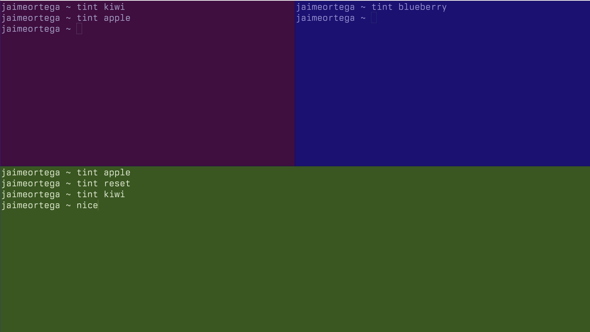

# tint

Three splits, three projects, three identical-looking terminals. You keep checking the path to remember which is which.

Just color them.



`tint` applies project-themed color palettes to individual Ghostty surfaces using escape sequences. Colors are derived from the project's own brand and design system. Close the tab, they're gone. Your Ghostty config stays untouched.

```bash
tint kiwi        # apply a saved theme
tint apple       # another one
tint blueberry   # one more
tint reset       # back to your default
tint ls          # list available themes
```

## Creating themes

With [Claude Code](https://claude.ai/claude-code), `cd` into any project and run `/tint-create`. Claude reads the codebase, extracts brand colors, designs a full terminal palette, previews it live, and saves it.

Without Claude Code, run `tint-create` and paste your brand hex colors. Less smart, still works.

## Install

```bash
git clone https://github.com/JaimeOrtegaxyz/tint ~/Documents/GitHub/tint
cd ~/Documents/GitHub/tint && ./install.sh
```

## How it works

OSC 10/11/12 set foreground, background, and cursor. [Kitty's OSC 21](https://sw.kovidgoyal.net/kitty/color-stack/) sets the full palette in one shot. Both are scoped to the current terminal surface only — other tabs, splits, and windows stay as they are.

Built for [Ghostty](https://ghostty.org). Probably works in Kitty too.
